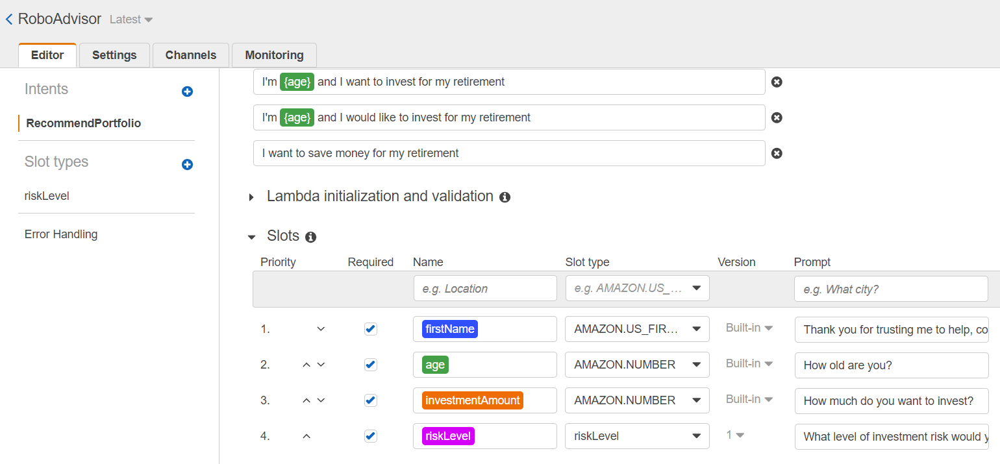
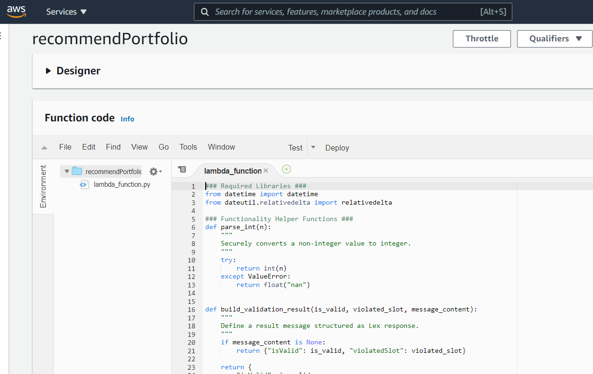

# Robo Advisor
The following assignment is to demonstrate my skills building a Robo Advisor!

---

## Table of contents
* [General Information](#general-information)
* [Screenshots](#screenshots)
* [Technologies](#technologies)
* [Installation Guide](#installation-guide)
* [Usage](#usage)
* [Sources](#sources)
* [Status](#status)
* [Contributors](#contributors)

---

## General Information

The following project represents a hypothetical scenario of being hired as a digital transformation consultant by one of the most prominent retirement plan providers in the country; they want to increase their client portfolio, especially by engaging young people. Since machine learning and NLP are disrupting finance to improve customer experience, a robo advisor will be built that can be used by customers or potential new customers to get investment portfolio recommendations for retirement.

This will involve combining new Amazon Web Services skills with already mastered Python superpowers, to create a bot that will recommend an investment portfolio for a retirement plan.

The following tasks are to be accomplished:

1. **Initial Robo Advisor Configuration**: Define an Amazon Lex bot with a single intent that establishes a conversation about the requirements to suggest an investment portfolio for retirement.

2. **Build and Test the Robo Advisor**: Make sure the bot is working and responding accurately along with the conversation with the user, by building and testing it.

3. **Enhance the Robo Advisor with an Amazon Lambda Function**: Create an Amazon Lambda function that validates the user's input and returns the investment portfolio recommendation. This task includes testing the Amazon Lambda function and making the integration with the bot.[1]

---

## Screenshots

* Amazon Lex Interface

* Amazon Lambda Interface

---

## Technologies

* Amazon Web Services (AWS) Lex
* AWS Lambda
* Python 3.7

---

## Installation Guide

1. Create an Amazon Lex Bot by importing the data found in RoboAdvisor_1_Bot_LEX_V1.zip provided in the repository.

2. Create an Amazon Lambda function titled recommendPortfolio.

3. Upload the lambda_function.py file found in the repository to the recommendPortfolio function.

4. Build the Lambda function and then build the Lex bot to run the bot.

---

## Usage

---

## Sources

- [1] https://rice.bootcampcontent.com/Rice-Coding-Bootcamp/rice-hou-fin-pt-09-2020-u-c/tree/master/hw/13-AWS-Lex/Instructions

---

## Status

Project is: _Complete_

---

## Contributors

* Jonathan Owens
* LinkedIn: www.linkedin.com/in/jonowens
